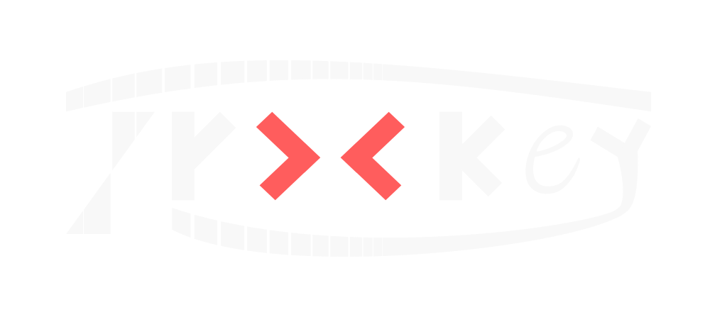
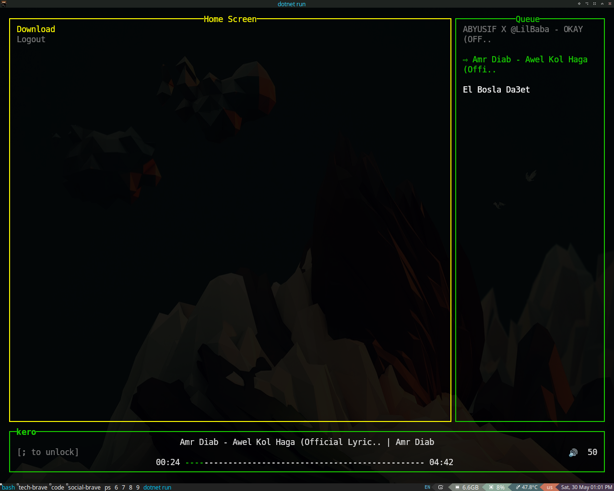

<a href="./img/logo-darkmode-transparent.svg">
    
</a>

# Trackey
> A terminal-based music player built for keyboard-first interaction, live playback controls, and a modern console UI experience.

[Trackey](/) is a cross-platform console music player written in C#.
The project focuses on creating a responsive and visually clean terminal application while exploring application architecture, async programming, and state-driven UI systems.





# Features

* Live playback panel with progress bar
* Queue management & track navigation
* Keyboard-driven interface
* User login & registration system
* YouTube audio downloading with live progress tracking
* Real-time updating console UI


# Current Status

Trackey is currently under active development.

Implemented so far:

* Audio playback system
* Queue system
* Authentication flow
* Download service
* Screen navigation system
* Live rendering UI loop
* Download progress panel

Planned:

* Search system
* Playlist management
* Settings screen
* Notifications system
* Better styling & animations
* Persistent library system


# Requirements

Before running the project, install the following dependencies:

## 1. .NET SDK

Trackey uses .NET.

### Install:

* Windows: download from Microsoft's official website
* Linux (Ubuntu/Debian):

```bash id="r1"
sudo apt install dotnet-sdk-9.0
```

Verify installation:

```bash id="r2"
dotnet --version
```


## 2. VLC / libVLC

Required for audio playback.

### Linux:

```bash id="r3"
sudo apt install vlc libvlc-dev
```

### Windows:

Install VLC Media Player from the official VLC website.


## 3. ffmpeg

Required for audio conversion after downloading.

### Linux:

```bash id="r4"
sudo apt install ffmpeg
```

### Windows:

Install ffmpeg and add it to PATH.

Verify:

```bash id="r5"
ffmpeg -version
```


## 4. yt-dlp

Required for downloading audio from YouTube.

### Linux:

```bash id="r6"
sudo apt install yt-dlp
```

### Windows:

Install yt-dlp and add it to PATH.

Verify:

```bash id="r7"
yt-dlp --version
```


# Running the Project

Clone the repository:

```bash id="r8"
git clone <repo-url>
cd Trackey
```

Build the project:

```bash id="r9"
dotnet build
```

Run:

```bash id="r10"
dotnet run
```

# Notes

Trackey is currently a learning-focused project and the architecture is evolving continuously as new systems are added.
